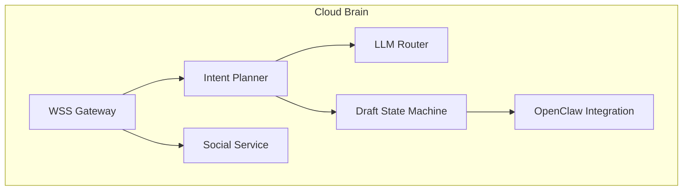
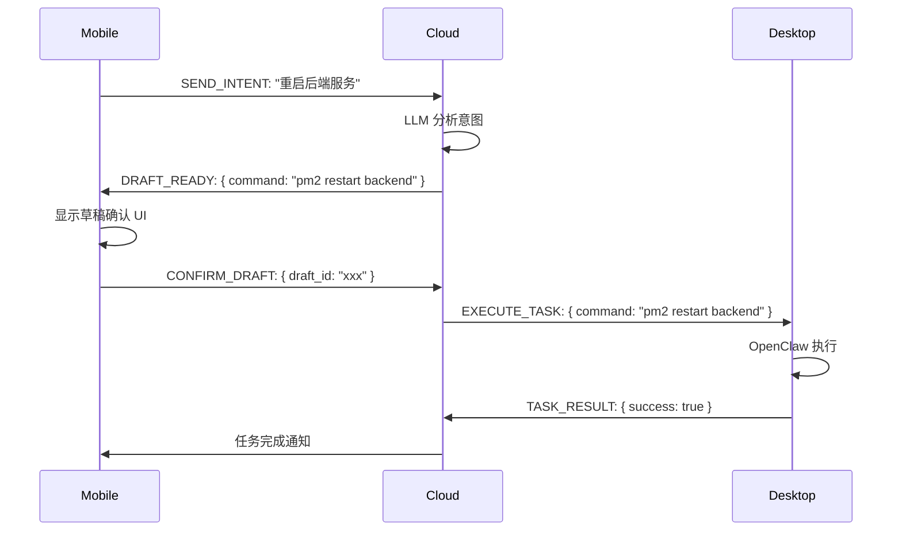
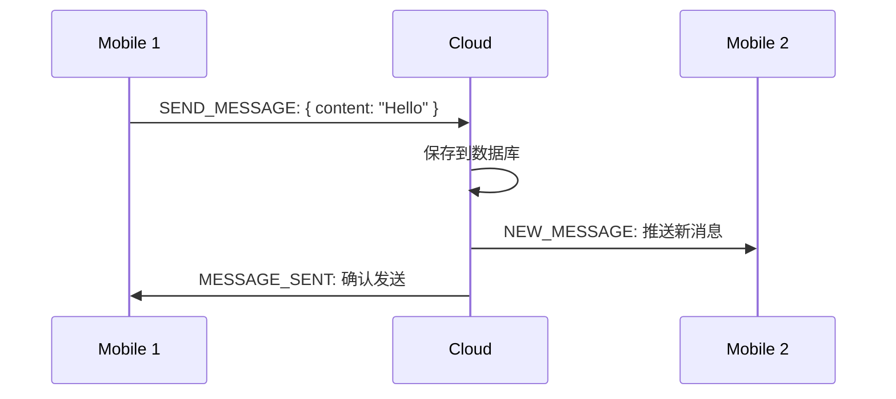
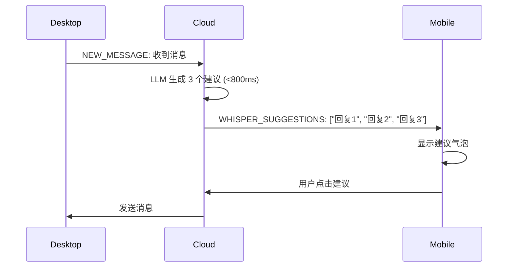

# Neural Link 系统架构文档 v2.0

| 文档属性 | 内容 |
| --- | --- |
| **版本** | **v2.0 (AI Native Social + Remote Work)** |
| **对应 PRD** | [PRD v2.0] |
| **核心变更** | 1. 独立社交 App 架构<br>2. OpenClaw 集成<br>3. 三端分布式系统 |

---

## 1. 高层架构

### 1.1 架构图

```
┌─────────────────┐         ┌─────────────────────┐         ┌─────────────────┐
│  Flutter Mobile │ ◄────► │    Cloud Brain      │ ◄────► │  Electron       │
│      App        │  WSS   │   (Node.js/TS)      │   WSS   │  Desktop Client │
│  (Controller)   │         │                     │         │  (Executor)     │
└─────────────────┘         └─────────────────────┘         └─────────────────┘
     ┌──────────┐                      ┌──────────┐              ┌──────────┐
     │Social UI │                      │Services  │              │Social UI │
     │Commands  │                      │          │              │OpenClaw  │
     │Draft UI  │                      │          │              │Worker    │
     └──────────┘                      └──────────┘              └──────────┘
```

### 1.2 三端职责

| 端 | 技术栈 | 核心职责 |
|---|--------|----------|
| **Mobile** | Flutter | 社交界面 + 发送指令 + 草稿确认 |
| **Cloud** | Node.js/TypeScript | WebSocket Gateway + Intent Planner + LLM Router |
| **Desktop** | Electron + Node.js/TS | 社交 UI + OpenClaw Worker + 本地任务执行 |

---

## 2. Cloud Brain 架构

### 2.1 核心服务



### 2.2 LLM 路由策略

| 任务类型 | 使用的模型 | 原因 |
|----------|-----------|------|
| 简单任务 | DeepSeek | 成本低 |
| 复杂任务 | Kimi 2.5 | 能力强 |

### 2.3 WebSocket 协议

#### 消息类型

```typescript
// 客户端 → 云端
type ClientMessage =
  | { type: 'AUTH'; payload: AuthPayload }
  | { type: 'SEND_MESSAGE'; payload: MessagePayload }
  | { type: 'SEND_INTENT'; payload: IntentPayload }
  | { type: 'CONFIRM_DRAFT'; payload: DraftConfirmPayload };

// 云端 → 客户端
type ServerMessage =
  | { type: 'NEW_MESSAGE'; payload: MessagePayload }
  | { type: 'DRAFT_READY'; payload: DraftPayload }
  | { type: 'TASK_RESULT'; payload: TaskResultPayload }
  | { type: 'WHISPER_SUGGESTIONS'; payload: SuggestionsPayload };
```

---

## 3. OpenClaw 集成

### 3.1 OpenClaw 简介

- **仓库**: https://github.com/openclaw/openclaw
- **能力**: 远程 Shell、文件管理、AI Agent
- **集成方式**: 作为 Desktop Client 的 Worker 模块

### 3.2 集成架构

```
┌──────────────────────────────────────────────────────────┐
│              Electron Desktop Client                      │
│  ┌────────────┐              ┌──────────────────────────┐ │
│  │ Social UI  │              │    OpenClaw Worker       │ │
│  │            │              │  ┌────────────────────┐  │ │
│  │  - Chat    │              │  │ Shell Executor     │  │ │
│  │  - Friends │              │  │ File Manager       │  │ │
│  │  - Draft   │              │  │ Browser Controller │  │ │
│  │    UI      │              │  └────────────────────┘  │ │
│  └────────────┘              └──────────────────────────┘ │
└──────────────────────────────────────────────────────────┘
```

### 3.3 指令接口

```typescript
interface OpenClawCommand {
  type: 'SHELL' | 'FILE_READ' | 'FILE_WRITE' | 'BROWSER';
  payload: {
    command?: string;      // Shell 命令
    path?: string;         // 文件路径
    url?: string;          // 浏览器 URL
    options?: Record<string, any>;
  };
}

interface OpenClawResult {
  success: boolean;
  data?: any;
  error?: string;
}
```

---

## 4. 数据库设计

### 4.1 核心表结构

```sql
-- 用户表
CREATE TABLE users (
    user_id UUID PRIMARY KEY,
    email VARCHAR(255) UNIQUE NOT NULL,
    password_hash VARCHAR(255) NOT NULL,
    display_name VARCHAR(100),
    avatar_url TEXT,
    created_at TIMESTAMP DEFAULT NOW()
);

-- 好友关系表
CREATE TABLE friendships (
    friendship_id UUID PRIMARY KEY,
    user_id UUID REFERENCES users(user_id),
    friend_id UUID REFERENCES users(user_id),
    status VARCHAR(20), -- 'PENDING', 'ACCEPTED'
    created_at TIMESTAMP DEFAULT NOW(),
    UNIQUE(user_id, friend_id)
);

-- 消息表
CREATE TABLE messages (
    message_id UUID PRIMARY KEY,
    sender_id UUID REFERENCES users(user_id),
    conversation_id UUID,
    content TEXT,
    message_type VARCHAR(20), -- 'TEXT', 'FILE', 'SYSTEM'
    created_at TIMESTAMP DEFAULT NOW()
);

-- 草稿表 (Draft & Verify)
CREATE TABLE drafts (
    draft_id UUID PRIMARY KEY,
    user_id UUID REFERENCES users(user_id),
    intent_type VARCHAR(50), -- 'SHELL', 'FILE', 'BROWSER'
    suggested_command TEXT,
    status VARCHAR(20), -- 'PENDING', 'CONFIRMED', 'EXECUTED', 'CANCELLED'
    result TEXT,
    created_at TIMESTAMP DEFAULT NOW()
);

-- 任务记录表
CREATE TABLE task_executions (
    task_id UUID PRIMARY KEY,
    user_id UUID REFERENCES users(user_id),
    draft_id UUID REFERENCES drafts(draft_id),
    desktop_session_id VARCHAR(100),
    command TEXT,
    result TEXT,
    status VARCHAR(20), -- 'RUNNING', 'SUCCESS', 'FAILED'
    started_at TIMESTAMP,
    completed_at TIMESTAMP
);
```

---

## 5. 核心交互流程

### 5.1 Draft & Verify 流程



### 5.2 消息同步流程



### 5.3 The Whisper 流程



---

## 6. 技术栈总结

| 层级 | 技术选择 |
|------|----------|
| **Mobile** | Flutter (Dart) |
| **Cloud** | Node.js + TypeScript |
| **Desktop** | Electron + Node.js + TypeScript |
| **Database** | PostgreSQL |
| **LLM** | DeepSeek (简单) + Kimi 2.5 (复杂) |
| **Protocol** | WebSocket (WSS) |
| **Repository** | Monorepo (pnpm workspace) |

---

## 7. 安全设计

### 7.1 通信安全

- 所有通信通过 WSS (TLS)
- 设备认证 Token 机制
- 消息端到端加密（可选）

### 7.2 执行安全

- 所有远程指令需要用户确认 (Draft & Verify)
- 危险命令二次确认
- 桌面端权限分级

---

## 8. 部署架构

```
                    ┌─────────────────┐
                    │   Load Balancer │
                    └────────┬────────┘
                             │
                ┌────────────┼────────────┐
                │            │            │
           ┌────▼────┐  ┌────▼────┐  ┌───▼─────┐
           │ Cloud 1 │  │ Cloud 2 │  │ Cloud 3 │
           └────┬────┘  └────┬────┘  └───┬─────┘
                │            │            │
                └────────────┼────────────┘
                             │
                    ┌────────▼────────┐
                    │   PostgreSQL    │
                    │   (Primary)     │
                    └─────────────────┘
                             │
                    ┌────────▼────────┐
                    │   PostgreSQL    │
                    │   (Replica)     │
                    └─────────────────┘
```

---

## 9. 开发里程碑

### Phase 1: 基础通信
- [ ] WebSocket 连接建立
- [ ] 消息收发
- [ ] 用户认证

### Phase 2: 社交功能
- [ ] 好友系统
- [ ] 1对1 聊天
- [ ] 消息推送

### Phase 3: 远程控制
- [ ] OpenClaw 集成
- [ ] Draft & Verify
- [ ] 任务执行与结果返回

---

*本文档版本：v2.0 | 最后更新：2026-02-11*
